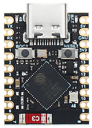

# HUEnergyDisplay - Hardware

## PCB Size

The size of the PCB is 300 mm x 210 mm.

It fits perfectly in an IKEA RÖDALM 21x30 cm picture frame
(IKEA article number is 005.488.82).
The edge of the PCB is designed to not interfere with the edge
of the picture frame.

There is a template available to drill the holes at the back of the
picture frame, so you can mount the PCB: [pcb_cutout.pdf](pcb_cutout.pdf)

## Schematics

## Controller

The PCB is designed to accomodate an ESP32-S3 SuperMini controller.

The firmware is ESPHome, you can find the configuration to it in the
[esphome](../esphome/README.md) folder.

### GPIO Pinout

| Pin    | Function         |
| ------ | ---------------- |
| GPIO0  | Boot button      |
| GPIO1  | MAX7219 CLK      |
| GPIO12 | MAX7219 MOSI     |
| GPIO13 | MAX7219 CS       |
| GPIO5-10 | 2.25" TFT display |
| GPIO4  | Ambient light sensor |
| GPIO48 | Status Led (currently not used) |
